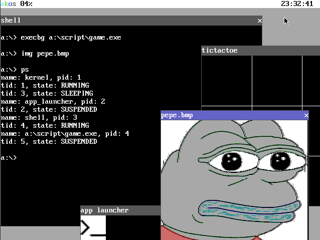

# AKOS OPERATING SYSTEM

Compiled using windows and gcc.

## PREREQUISITES

mingw32 -> make, ld, gcc
nasm
python 3.x
windows 32 bit
qemu emulator/bochs emulator (bochs is much slower)
dd
WinImage

## CURRENTLY SUPPORTS

- Boot from virtualfloppy drive with fat12 fs minidriver

- PS/2 drivers (keyboard input,visible mouse cursor)

- pit timer

- Shell gui

- VMM and PMM (and kheap memory allocation)

- IDT,ISRS,IRQS

- 3.5 inch floppy driver

- Virtual file system with volume manager, fat12 filesystem and RAM file system

- Loading PE executable into disk

- Preemptive multitasking

- Running PE executable in usermode + task priority

- Window system running in the kernel that supports events

- int 0x80 maskable syscalls including some unix ones:
	- print
	- terminate process
	- fork (creates new thread, not new process with copied virt space)
	- window system operations (see examples in root/script)
	- file operations
	- dynamic memory allocation

- 16 color vga 640x480 mode graphics

## BUILD

run ./make in the original folder.

## RUN INSTRUCTIONS

to start, run "make runq" to run with QEMU or "make run" to run with BOCHS, change the parameter in the makefile accordingly.

to view fat12 filesystem run "make inspect", the filesystem builds from the folder "root" in the make directory, put all the stuff in there.

type help in the shell to get a list of commands, type "help COMMAND" to get help for a specific command.

## VIRTUAL MEMORY STRUCTURE

0MB-1MB -> KERNEL BOOT STACK,BIOS INTERRUPTS

1MB-2MB -> REAL KERNEL + GDT + IDT + PMM

4MB-3GB -> USER LAND SPACE

3GB -> VIRTUAL KERNEL

3GB + 2MB-3MB -> KHEAP

3GB + 3MB-4MB -> RAM FS

